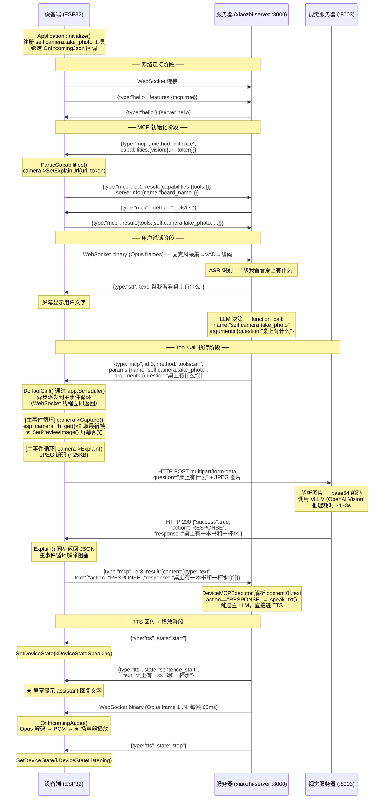

# 技术调研报告

> 调研日期：2026-03-15

---

## 1. CherryUSB 作为 Host 时是否支持 UVC？

**结论：支持，但仅限 UVC 1.5，不支持 UVC 2.0。**

CherryUSB 在 `xiaozhi-sf32/sdk/external/cherryusb/class/video/` 目录下提供了完整的 UVC Host 驱动：

| 文件 | 作用 |
|------|------|
| `usbh_video.h` | Host UVC 类驱动头文件，定义 `struct usbh_video`、`usbh_video_open/close/run/stop` 等 API |
| `usbh_video.c` | Host UVC 类驱动实现 |
| `usb_video.h` | UVC 协议常量、描述符结构体（含 H264、VP8、MJPEG、Uncompressed 等格式） |
| `usbd_video.h/c` | Device 端 UVC 驱动（用于让设备模拟摄像头） |

**关键特性：**

- 同时支持 **MJPEG** 和 **Uncompressed（YUV）** 两种格式
- 通过 ISO IN 端点接收视频数据流
- 支持 Probe/Commit 协商流程（完整 7 步协商），可按分辨率选择（最多 3 种格式 × 12 种分辨率）
- 通过 `CONFIG_CHERRYUSB_HOST_VIDEO` 编译选项启用

**关于 UVC 版本：**

- 协议版本常量为 `VIDEO_PC_PROTOCOL_15 0x01`（UVC 1.5）
- 未发现任何 UVC 2.0 特有扩展（SuperSpeedPlus 传输、新 Control Request 等）
- **CherryUSB Host UVC 仅支持 UVC 1.5，不支持 UVC 2.0**

---

## 2. xiaozhi-esp32 如何传输视频数据到服务器？

**结论：按需拍照 → JPEG 编码 → HTTP POST multipart/form-data，不是连续视频流。**

### 2.1 整体架构

xiaozhi-esp32 **当前不支持连续视频流**，视频功能使用场景是 MCP 工具调用（`self.camera.take_photo`），即按需拍照并发给 AI 服务分析。

### 2.2 实现流程（`esp32_camera.cc` → `Explain()` 函数）

```
摄像头 Driver (esp_video / V4L2)
        │  Capture() —— YUYV/RGB 数据写入 frame_.data
        ▼
独立编码线程（encoder_thread_）
        │  image_to_jpeg_cb() 将 YUV/RGB 编码为 JPEG
        │  每个 JPEG 分块写入 QueueHandle_t jpeg_queue
        ▼
主线程 HTTP 发送（同步读取队列）
        │  HTTP POST → explain_url_
        │  Content-Type: multipart/form-data; boundary=...
        │  Transfer-Encoding: chunked
        │    Part 1：question 字段（文本）
        │    Part 2：file 字段头（Content-Disposition + Content-Type）
        │    Part 3：JPEG 数据（从队列逐块写入）
        │    Part 4：multipart 尾部
        ▼
AI 视觉服务器响应 JSON → 返回 Explain() 调用方
```

### 2.3 关键实现细节

| 要素 | 说明 |
|------|------|
| 摄像头接口 | ESP-IDF `esp_video` + Linux V4L2 API，支持 MIPI CSI 和 DVP 接口 |
| 图像编码 | `image_to_jpeg_cb()` 编码，质量参数 80，独立线程执行（约 500ms，消耗约 8KB SRAM） |
| 传输方式 | HTTP POST，`Transfer-Encoding: chunked`，避免一次性分配大块内存 |
| 认证 | HTTP Header：`Device-Id`（MAC 地址）、`Client-Id`（UUID）、`Authorization: Bearer <token>` |
| 触发方式 | MCP 工具调用触发，不是持续推流 |

### 2.4 现有局限

- 无连续视频流（无 RTSP/WebRTC/RTP 等）
- 协议层目前仅有 `SendAudio()`，**无 `SendVideo()` 接口**
- 图片上传地址由服务器握手时动态下发（`capabilities.vision.url`），设备无需硬编码

---

## 3. ML307 支持更高波特率吗（2M / 3M）？

**结论：不支持，ML307C 最高官方支持波特率为 921600 bps。**

### 3.1 文档依据

**`AT_Commands_Reference_Guide_4G_Series_V2.0.5.md` § 3.20 AT+IPR：**

> `<rate>` 支持值：0 (auto), 110, 300, 1200, 2400, 4800, 9600, 19200, 38400, 57600, 115200, 230400, 460800, **921600**, etc.

**`ML307C_通信流程示例_V1.0.0.md` § 8.1 串口波特率：**

> 固定波特率范围：1200 / 4800 / 9600 / 19200 / 38400 / 57600 / 115200 / 230400 / 460800 / **921600** bps

**`ML307_Implementation_Guide.md`：**

- 驱动代码目标波特率：**921600**
- 探测顺序：115200 → 921600 → 460800 → 230400 → 57600 → 38400 → 19200 → 9600

### 3.2 结论

- 所有文档明确列出的最高波特率均为 **921600 bps**，不支持 1.5M、2M、3M
- 如需更高吞吐，应从网络层优化，而非提升 UART 波特率

---

## 4. SF32LB52 是否支持 USB Host？

**结论：支持 USB Host（MUSB 控制器，支持 FS 和 HS）。**

### 4.1 HAL 层证据

`modules/hal/sifli/hal/src/bf0_hal_hcd.c` 中 `HAL_HCD_MspInit` 明确包含 SF32LB52X 分支：

```c
#elif defined(SF32LB56X)||defined(SF32LB52X)
    hwp_hpsys_cfg->USBCR |= HPSYS_CFG_USBCR_DM_PD | HPSYS_CFG_USBCR_DP_EN | HPSYS_CFG_USBCR_USB_EN;
```

- 完整实现了 `HAL_HCD_Init()`、`HAL_HCD_HC_Init()`、`HAL_HCD_HC_SubmitRequest()` 等接口
- 支持 DMA 传输（TX DMA + RX 连续 DMA）
- EP 说明：EP2-4 仅 IN，EP5-7 仅 OUT，EP0-1 双向，最多 3 个并发 IN 通道
- `usb_hc_musb.c` 检测 `USB_POWER_HSMODE` 寄存器位，**确认支持 USB 2.0 High Speed（480 Mbps）**

### 4.2 CherryUSB 对 SF32LB52 Host 的支持

```c
// usb_hc_musb.c
#if defined(CONFIG_USB_MUSB_SIFLI) && (defined(SF32LB52X) || defined(SF32LB56X))
// SiFli EP 映射逻辑
```

- 通过 `PKG_CHERRYUSB_HOST_MUSB_SIFLI` 配置项启用
- 编译文件：`port/musb/usb_hc_musb.c` + `port/musb/usb_glue_sifli.c`

### 4.3 结论

- SF32LB52 具备 USB Host 硬件能力，HAL 和 CherryUSB 均已完成移植
- 可结合 CherryUSB Host UVC 驱动接入 USB UVC 摄像头

---

## 5. 需要购买什么样的 UVC 摄像头？

### 5.1 基本要求

不是所有注明"支持 UVC"的摄像头都能直接使用，需要满足以下条件：

| 要求 | 说明 |
|------|------|
| **UVC 规范版本** | UVC 1.0 / 1.1 / 1.5 均可；UVC 2.0 规范的摄像头若同时向下兼容 UVC 1.5（绝大多数支持）也可使用 |
| **USB 接口速度** | USB 2.0（Full Speed 或 High Speed）均可；SF32LB52 不支持 USB 3.x，**不要买只支持 USB 3.x SuperSpeed 的专用摄像头** |
| **格式支持** | 必须支持 **MJPEG** 格式（强烈推荐）；若仅支持 Uncompressed（YUV422），小分辨率也可用，但 USB 带宽压力大 |
| **分辨率枚举** | 摄像头需在其 UVC 描述符中**明确列出**目标分辨率（如 320×240）；CherryUSB 只能使用摄像头描述符里已声明的分辨率 |
| **供电** | USB 2.0 标准供电 500mA；需确认 SF32LB52 的 VBUS 供电能力 |

### 5.2 如果摄像头支持 1080p，可以设置只拍 320×240 吗？

**可以，但有前提条件。**

CherryUSB UVC Host 的分辨率选择完全依赖于摄像头的 UVC 描述符，工作流程如下：

```
枚举阶段（连接时自动执行）：
    usbh_video.c 解析摄像头 UVC 描述符
    将所有 bFormatIndex + bFrameIndex 对读入 format[3].frame[12] 表
    （最多 3 种格式 × 12 种分辨率）

打开阶段（应用层调用）：
    usbh_video_open(video_class, USBH_VIDEO_FORMAT_MJPEG, 320, 240, altsetting)
    ↓
    代码遍历 format 表，查找 wWidth==320 && wHeight==240 的精确匹配
    ↓
    找到 → 发送 Probe SET_CUR 7 步协商 → 成功打开
    找不到 → 返回 -USB_ERR_NODEV（失败）
```

**结论：**

- 支持 1080p 的摄像头**通常也会枚举低分辨率**（如 160×120、320×240、640×480、1280×720、1920×1080 等多档），主流品牌和大部分国产免驱网络摄像头均如此
- 只要摄像头描述符中**包含了 320×240 这一档**，就可以成功以 320×240 模式打开，摄像头硬件会自动降低分辨率采集
- 并非所有 1080p 摄像头都一定枚举 320×240；可用 Windows 设备管理器 / USBTreeView 工具提前确认描述符中包含目标分辨率
- 调试时可调用 `usbh_video_list_info()` 打印摄像头支持的所有格式和分辨率

### 5.3 推荐摄像头规格

| 规格项 | 推荐值 |
|--------|--------|
| USB 规范 | USB 2.0 High Speed |
| UVC 版本 | UVC 1.0 ~ 1.5 |
| 视频格式 | 必须支持 MJPEG |
| 分辨率档位 | 应包含 320×240 或 640×480 |
| 接口 | 标准 Type-A（连接 SF32LB52 USB Host 口） |
| 最大分辨率 | 无硬性要求，720p 够用，1080p 也可 |
| 供电 | 500mA USB 总线供电 |

### 5.4 不推荐的摄像头类型

- **仅支持 USB 3.x SuperSpeed 的摄像头**（SF32LB52 无 USB 3.x 控制器）
- **只有 UVC 2.0 无向下兼容的摄像头**（市场上极少见，大多数 UVC 2.0 设备兼容 1.5）
- **需要独立驱动的专有协议摄像头**（少数特殊型号）
- **只支持 H264/VP8 原生输出且无 MJPEG 的摄像头**（CherryUSB UVC Host 对 frame-based 格式支持有限）

---

## 6. SF32LB52 + CherryUSB UVC Host + ML307 + Zephyr 拍照发送方案可行性

### 6.1 方案功能目标

用 USB UVC 摄像头（USB Device）连接到 SF32LB52（作为 USB Host），拍照后通过 ML307（4G 模块，UART 连接）HTTP POST 上传到服务器。

### 6.2 各环节可行性

| 环节 | 结论 | 依据 |
|------|------|------|
| USB UVC 摄像头 → SF32LB52 Host | ✅ 可行 | CherryUSB `usbh_video.c` 实现完整，sifli MUSB Host glue 已支持 SF32LB52X |
| SF32LB52 USB Host 硬件 | ✅ 可行 | `bf0_hal_hcd.c` 中 `HAL_HCD_MspInit` 含 SF32LB52X 分支，支持 HS |
| CherryUSB 运行在 Zephyr | ⚠️ 需集成 | `CMakeLists.txt` 有 `ZEPHYR_BASE` 分支，理论可行，需额外适配工作 |
| ML307 HTTP 上传图片 | ✅ 可行 | ML307 支持 `AT+MHTTPFILE` 文件上传 |
| UART 921600 传输图片 | ⚠️ 单张可行 / ❌ 视频流不可行 | 见下节 |

### 6.3 系统方案框图

```
USB UVC 摄像头（MJPEG，320×240）
      │  USB 2.0 HS，ISO IN 端点
      ▼
SF32LB52（USB Host）
  CherryUSB usbh_video_open() → 接收 MJPEG 帧到内存
  （可选：JPEG 二次裁剪 / 质量压缩）
      │
      │  UART 921600 bps
      ▼
ML307（4G 模组）
  AT+MHTTPFILE → HTTP POST 上传 JPEG
  AT+MHTTPREQUEST
      │  4G LTE 数据通道
      ▼
AI 视觉服务器（HTTP POST）
      │  返回 JSON 分析结果
      ▼
ML307 → UART → SF32LB52
  解析结果，TTS 播报 / 显示
```

### 6.4 UART 921600 bps 是否足够？

**UART 8N1 有效吞吐：**

```
921600 bps ÷ 10 bit/byte = 92,160 byte/s ≈ 90 KB/s（理论峰值）
实际有效吞吐（AT 命令开销）≈ 60~75 KB/s
```

**按分辨率估算全链路单次拍照延迟：**

| 分辨率 | 典型 JPEG 大小 | UART 传输 | 4G 网络 | 合计（含AT初始化+AI处理） |
|--------|---------------|-----------|---------|--------------------------|
| 160×120 | ~8 KB | ~90 ms | ~50 ms | ~2 s |
| 320×240 | ~25 KB | ~280 ms | ~100 ms | ~3~5 s |
| 640×480 | ~60 KB | ~700 ms | ~200 ms | ~5~8 s |
| 1280×720 | ~150 KB | ~1.7 s | ~500 ms | ~8~12 s |

**结论：**

- **按需单张拍照**：921600 bps **足够**，320×240 MJPEG 整体延迟约 3~5 秒，体验可接受
- **连续视频流**：**完全不可行**，320×240@5fps 需约 750 KB/s，是 UART 上限的 8 倍

### 6.5 实施建议

1. 摄像头选择支持 MJPEG + 分辨率含 320×240 的 USB 2.0 UVC 摄像头，避免在 SF32LB52 上做 YUYV→JPEG 软件压缩
2. 分辨率锁定 320×240，兼顾 AI 识别精度与传输速度
3. 在 Zephyr 上集成 CherryUSB，参考 `xiaozhi-sf32/sdk/external/cherryusb/CMakeLists.txt` 的 `ZEPHYR_BASE` 分支
4. ML307 HTTP 上传采用 `AT+MHTTPFILE` 方式，需在发送前将完整 JPEG 数据缓存在 SF32LB52 RAM 中

---

## 7. xiaozhi-esp32 摄像头实现方案详细分析

### 7.1 整体架构：Camera 抽象层

所有摄像头通过统一的纯虚接口暴露给上层（MCP 工具、显示等）：

```cpp
// main/boards/common/camera.h
class Camera {
public:
    virtual void SetExplainUrl(const std::string& url, const std::string& token) = 0;
    virtual bool Capture() = 0;
    virtual bool SetHMirror(bool enabled) = 0;
    virtual bool SetVFlip(bool enabled) = 0;
    virtual std::string Explain(const std::string& question) = 0;
};
```

项目中有两套实现：

| 实现类 | 文件 | 适用场景 |
|--------|------|---------|
| `Esp32Camera` | `boards/common/esp32_camera.cc` | 通用实现，支持 DVP、MIPI-CSI、USB UVC |
| `SscmaCamera` | `boards/sensecap-watcher/sscma_camera.cc` | SenseCAP Watcher 专用，使用 SSCMA AI 协处理器（SPI 协议）|

---

### 7.2 Esp32Camera：支持的硬件接口

`Esp32Camera` 构造函数接受 `esp_video_init_config_t`，根据其中非空的指针决定打开哪个 `/dev/videoX` 设备：

| 配置字段 | 硬件接口 | 典型传感器 | 设备节点 |
|----------|---------|-----------|---------|
| `config.dvp` | DVP（并行摄像头） | OV2640、OV5640 | `ESP_VIDEO_DVP_DEVICE_NAME` |
| `config.csi` | MIPI-CSI（串行摄像头） | SC2336、IMX500 等 | `ESP_VIDEO_MIPI_CSI_DEVICE_NAME` |
| `config.usb_uvc` | USB UVC（ESP32 作为 USB Host） | 任意 UVC 设备 | `ESP_VIDEO_USB_UVC_DEVICE_NAME(0)` |
| `config.jpeg` | 硬件 JPEG 解码器 | — | — |
| `config.spi` | SPI 摄像头 | — | — |

各板卡实际使用情况：
- **大多数 ESP32-S3 板卡**：DVP，8-bit 并行（D0-D7 + VSYNC + HREF + PCLK + XCLK）
- **ESP32-P4 板卡**（waveshare-p4-nano 等）：MIPI-CSI，XCLK 12MHz
- **USB UVC**：代码路径存在（`#if CONFIG_ESP_VIDEO_ENABLE_USB_UVC_VIDEO_DEVICE`），但目前所有板卡均未配置 `config.usb_uvc`

---

### 7.3 Esp32Camera 构造函数：初始化流程

```
esp_video_init(&config)             // 初始化 esp_video 框架与传感器驱动
        │
        ▼
open("/dev/videoX", O_RDWR)        // 打开对应视频设备节点
        │
        ▼
VIDIOC_QUERYCAP                    // 查询设备能力
        │
        ▼
VIDIOC_G_FMT                       // 获取当前格式（分辨率等）
        │
        ▼
VIDIOC_ENUM_FMT                    // 枚举传感器支持的所有像素格式
        │  按优先级选出最佳格式（见 7.4）
        ▼
VIDIOC_S_FMT                       // 设置选定的像素格式
        │
        ▼
VIDIOC_REQBUFS                     // 申请 mmap 缓冲
        │  DVP: 1个缓冲；MIPI-CSI: 2个缓冲
        ▼
VIDIOC_QUERYBUF + mmap()           // 将内核缓冲映射到用户空间
        │
        ▼
VIDIOC_QBUF                        // 将缓冲入队（交给驱动）
        │
        ▼
VIDIOC_STREAMON                    // 开始视频流
        │
        ▼
（若启用 ISP）后台预热任务         // 丢弃5秒内所有帧，等待 ISP 参数收敛
        │
        ▼
streaming_on_ = true               // 就绪
```

**SCCB 配置两种模式：**
- `init_sccb = false`：复用已有 I2C bus handle（大多数板卡）
- `init_sccb = true`：独立初始化新的 I2C 端口（kevin-sp-v3/v4、df-s3-ai-cam 等）

---

### 7.4 像素格式选择策略

初始化时通过 `VIDIOC_ENUM_FMT` 枚举传感器支持的全部格式，用 rank 函数选出最优格式：

**普通场景（无 PPA 旋转）：**

| 优先级 | 格式 | rank |
|--------|------|------|
| 1（最优） | YUV422P / YUYV | 10 |
| 2 | RGB565 | 11 |
| 3 | RGB24 | 12 |
| 4（可选编译）| YUV420 (HW JPEG) | 13 |
| 5（可选编译）| JPEG 直接输入 | 5 |
| 低优先级 | GREY | 20 |

**ESP32-P4 PPA 硬件旋转场景：**

| 优先级 | 格式 |
|--------|------|
| 1（最优） | RGB24 |
| 2 | RGB565 |
| 3（HW JPEG 可选）| YUV420 |

> `V4L2_PIX_FMT_YUV422P` 在当前 esp_video 版本中实际输出 YUYV（非 planar），代码有注释说明。

---

### 7.5 Capture() 实现细节

```cpp
bool Esp32Camera::Capture() {
    // 1. 等待上一次 encoder_thread_ 结束（避免并发访问 frame_）
    if (encoder_thread_.joinable()) encoder_thread_.join();

    // 2. 连续 DQBUF 3 次，丢弃前两帧，只保留第三帧
    //    目的：刷新摄像头内部缓冲，确保获得最新画面（而非缓冲区里的旧帧）
    for (int i = 0; i < 3; i++) {
        VIDIOC_DQBUF;                  // 从驱动取出已填充的帧
        if (i == 2) {
            memcpy(frame_.data, buf, len); // 只保存第三帧
        }
        VIDIOC_QBUF;                   // 将缓冲归还驱动
    }

    // 3. 图像旋转（可选，见 7.6）

    // 4. 显示预览（见 7.7）
}
```

**帧副本内存：** 分配在 PSRAM（`MALLOC_CAP_SPIRAM`），通过 `heap_caps_malloc()` 申请。

**大端序翻转（`CONFIG_XIAOZHI_ENABLE_CAMERA_ENDIANNESS_SWAP`）：** 部分传感器字节序与 ESP32 不一致时，可开启此选项对 16-bit 数据做 `__builtin_bswap16()` 逐像素翻转。

---

### 7.6 图像旋转：两种实现路径

当板卡摄像头物理安装方向与显示方向不一致时，可通过 `CONFIG_XIAOZHI_ENABLE_ROTATE_CAMERA_IMAGE` 配置旋转（90° 或 270°）：

**路径一：软件旋转（非 P4 芯片）**

```
esp_imgfx_rotate_open(&cfg)
esp_imgfx_rotate_process(src → dst)    // CPU 密集，消耗较多时间
esp_imgfx_rotate_close()
```

支持格式：RGB565、YUYV（映射为 RGB565_LE）、GREY、RGB24

**路径二：PPA 硬件加速（ESP32-P4，`CONFIG_SOC_PPA_SUPPORTED`）**

```
ppa_register_client(PPA_OPERATION_SRM)
ppa_do_scale_rotate_mirror()    // 硬件完成，速度远快于软件
ppa_unregister_client()
```

- 输入：RGB565 或 RGB24（YUYV 需先用 `esp_imgfx_color_convert` 转 RGB888）
- 输出：统一为 RGB565
- 支持缩放（当前设置 scale_x=1.0, scale_y=1.0）

---

### 7.7 LVGL 预览显示

`Capture()` 完成后，若当前 Display 是 `LvglDisplay` 类型，会自动将帧转换为 RGB565 并调用 `SetPreviewImage()` 显示到屏幕：

```cpp
auto display = dynamic_cast<LvglDisplay*>(Board::GetInstance().GetDisplay());
if (display != nullptr) {
    // 格式转换（YUYV/YUV420/RGB24 → RGB565 via esp_imgfx_color_convert）
    // JPEG 输入需先解码
    auto image = std::make_unique<LvglAllocatedImage>(data, ...);
    display->SetPreviewImage(std::move(image));
}
```

颜色空间转换标准：`ESP_IMGFX_COLOR_SPACE_STD_BT601`

---

### 7.8 SetHMirror / SetVFlip

直接通过 V4L2 扩展控制接口发给传感器驱动：

```cpp
ctrl.id = V4L2_CID_HFLIP;   // 或 V4L2_CID_VFLIP
ctrl.value = enabled ? 1 : 0;
ioctl(video_fd_, VIDIOC_S_EXT_CTRLS, &ctrls);
```

各板卡出厂配置：

| 板卡 | HMirror | VFlip |
|------|---------|-------|
| lilygo-t-cameraplus-s3 | true | true |
| m5stack-core-s3 | false | — |
| df-s3-ai-cam | — | true（VFlip=1） |
| atoms3r-cam-m12 | false | — |
| esp-sparkbot | 读 NVS `camera-flipped`（默认 true） | 同上 |

---

### 7.9 Explain()：异步 JPEG 编码 + HTTP 上传

```
调用 Explain(question)
        │
        ▼
创建 FreeRTOS 队列 jpeg_queue（容量 40 项，每项 JpegChunk）
        │
        ├──[独立线程 encoder_thread_]──────────────────────────────┐
        │   image_to_jpeg_cb(                                      │
        │     frame_.data, frame_.len,                             │
        │     frame_.width, frame_.height,                         │
        │     sensor_format_, quality=80,                          │
        │     callback → xQueueSend(jpeg_queue, chunk)             │
        │   )                                                       │
        │   编码完成后发送哨兵 chunk（data=nullptr）触发结束       │
        └──────────────────────────────────────────────────────────┘
        │
        ▼
[ 主流程同步进行 HTTP ]
http->SetHeader("Device-Id", mac)
http->SetHeader("Client-Id", uuid)
http->SetHeader("Authorization", "Bearer " + token)
http->SetHeader("Content-Type", "multipart/form-data; boundary=----ESP32_CAMERA_BOUNDARY")
http->SetHeader("Transfer-Encoding", "chunked")
http->Open("POST", explain_url_)
        │
        ▼
写 multipart Part1（question 文本字段）
        │
        ▼
写 multipart Part2（文件头：Content-Disposition + Content-Type）
        │
        ▼
循环 xQueueReceive(jpeg_queue) → http->Write(chunk)
  直到收到哨兵 chunk（data==nullptr）
        │
        ▼
写 multipart 尾部 "--boundary--\r\n"
http->Write("", 0)   ← 结束 chunked 传输
        │
        ▼
等待 encoder_thread_.join()
        │
        ▼
http->GetStatusCode() == 200 → http->ReadAll() → return JSON
```

**关键设计要点：**

| 要点 | 说明 |
|------|------|
| 编码与发送并行 | 编码线程 + HTTP 发送同步推进，无需等编码完成再发送 |
| 分块传输 | `Transfer-Encoding: chunked`，JPEG 数据逐块写入，避免一次性分配大 buffer |
| PSRAM 分配 | 每个 JpegChunk 数据用 `heap_caps_aligned_alloc(16, ...)` 分配在 PSRAM |
| 队列容量 | 40 项 × 512 字节/项 = 约 20KB 的流控缓冲 |
| JPEG 质量 | 固定 quality=80，约 500ms，约消耗 8KB SRAM |
| 任务优先级降低 | 调用前 `TaskPriorityReset priority_reset(1)` 临时降低优先级，避免影响音频 |

---

### 7.10 MCP 工具注册与调用流程

**工具注册（`mcp_server.cc` 启动时）：**

```cpp
auto camera = board.GetCamera();
if (camera) {
    AddTool("self.camera.take_photo",
        "Take a photo and explain it.",
        PropertyList({ Property("question", kPropertyTypeString) }),
        [camera](const PropertyList& properties) -> ReturnValue {
            TaskPriorityReset priority_reset(1);   // 降低任务优先级
            if (!camera->Capture()) {
                throw std::runtime_error("Failed to capture photo");
            }
            auto question = properties["question"].value<std::string>();
            return camera->Explain(question);
        });
}
```

**完整交互时序（用户说"请拍照"）：**

```
用户语音 → STT → LLM 决策调用 self.camera.take_photo
        │
        ▼
MCP tools/call 消息 → 设备 Application::OnIncomingJson()
        │  type == "mcp" → McpServer::ParseMessage()
        ▼
McpServer::DoToolCall() → Application::Schedule(lambda) 切主线程
        │
        ├─ camera->Capture()   （取第三帧 + 预览显示）
        └─ camera->Explain(question)   （编码 + HTTP POST）
                │
                ▼
        AI 视觉服务器返回 JSON 分析结果
                │
                ▼
McpServer::ReplyResult() → 发回服务器
        │
        ▼
服务器 LLM 生成语音 → 设备 TTS 播放
```

**视觉服务器 URL 动态下发：**

```cpp
// mcp_server.cc: 握手时处理 capabilities.vision
auto vision = cJSON_GetObjectItem(capabilities, "vision");
if (cJSON_IsObject(vision)) {
    camera->SetExplainUrl(url->valuestring, token->valuestring);
}
```

---

### 7.11 SscmaCamera 变体（SenseCAP Watcher 专用）

SenseCAP Watcher 使用片外 AI 协处理器（SSCMA Client），与 `Esp32Camera` 完全不同：

| 维度 | Esp32Camera | SscmaCamera |
|------|------------|-------------|
| 摄像头连接 | DVP/CSI 直连 ESP32 | 通过 SPI 连接 SSCMA AI 芯片，再由 AI 芯片控制摄像头 |
| 拍照获取 | V4L2 VIDIOC_DQBUF | `sscma_client_invoke()` + 回调函数接收 Base64 JPEG |
| AI 处理 | 云端视觉 API | 本地模型推理（目标检测/分类/姿态估计） + 云端 |
| 分辨率双模 | 单一分辨率 | 416×416（推理）/ 640×480（拍照），分别触发不同逻辑 |
| 触发方式 | 主动调用 `Capture()` | 持续推理 + 检测状态机自动触发（IDLE→VALIDATING→COOLDOWN）|
| 图像解码 | 无需额外解码 | `esp_jpeg_dec` 解码 Base64 JPEG → RGB565 |

**SSCMA 检测状态机（用于自动唤醒）：**

```
IDLE ──[连续检测到目标]──▶ VALIDATING（计时 detect_duration_sec）
              │
              │ [持续检测满时间]
              ▼
        触发 Application::WakeWordInvoke()
              │
              ▼
        COOLDOWN（冷却 detect_invoke_interval_sec，且目标已离开后）
              │
              ▼
        IDLE （等待下次出现）
```

---

### 7.12 板卡摄像头初始化汇总

| 板卡 | 接口 | SCCB 复用 | XCLK 频率 | 特殊配置 |
|------|------|----------|----------|---------|
| lilygo-t-cameraplus-s3 | DVP | v1.0/v1.1 复用；v1.2 独立 | XCLK_FREQ_HZ | VFlip=1, HMirror=1 |
| m5stack-core-s3 | DVP | 复用 | XCLK_FREQ_HZ | HMirror=false |
| m5stack-tab5 | MIPI-CSI | 复用 | 12MHz（ESP CLOCK ROUTER / LEDC） | — |
| waveshare-p4-nano | MIPI-CSI | 复用 | 12MHz | — |
| waveshare-p4-wifi6-* | MIPI-CSI | 复用 | 12MHz | — |
| esp-sparkbot | DVP | 复用 | SPARKBOT_CAMERA_XCLK_FREQ | HMirror/VFlip 读 NVS |
| df-s3-ai-cam | DVP | 独立 | XCLK_FREQ_HZ | VFlip=1 |
| atoms3r-cam-m12 | DVP | 独立 | XCLK_FREQ_HZ | HMirror=false，需先调 EnableCameraPower() |
| atk-dnesp32s3 | DVP | 独立 | 20MHz，通过 XL9555 IO 扩展控制 RESET/PWDN | — |
| sensecap-watcher | SPI（SSCMA）| — | — | SSCMA 专用，非 Esp32Camera |

---

## 8. 将 xiaozhi-esp32 方案移植到 SF32LB52 + ML307 的差异分析

### 8.1 主要差异对比

| 维度 | xiaozhi-esp32 | SF32LB52 + ML307 方案 |
|------|--------------|----------------------|
| 网络接入 | WiFi / 4G（板上集成） | 4G（ML307 通过 UART AT 命令） |
| HTTP 实现 | ESP-IDF esp_http_client（直接 TCP） | ML307 `AT+MHTTPFILE` / `AT+MIPSEND` |
| 摄像头接口 | DVP / MIPI-CSI（板载） | USB UVC（外接，CherryUSB Host） |
| 图像传输路径 | 内存 JPEG → 本地 HTTP POST | 内存 JPEG → UART → ML307 → HTTP POST |
| 传输瓶颈 | WiFi 几十 Mbps，无瓶颈 | **UART 921600 bps（~90 KB/s），关键瓶颈** |
| 推荐分辨率 | 最高 1080p | **建议 320×240（~25KB JPEG）** |
| RTOS | FreeRTOS | Zephyr |
| MCP 协议 | 完整实现 | 需移植或简化实现 |

### 8.2 ML307 HTTP 上传图片 AT 命令示例

```
AT+MHTTPCREATE=0,"https://your-vision-server.com"
OK
AT+MHTTPHEADER=0,"Authorization","Bearer <token>"
OK
AT+MHTTPHEADER=0,"Device-Id","<mac_address>"
OK
AT+MHTTPFILE=0,0,"image/jpeg",<file_size>
> （等待提示符后直接发送 JPEG 二进制数据）
AT+MHTTPREQUEST=0,1,"/vision/explain"
OK
+MHTTPRESPONSE: 0,200,...
```

### 8.3 实施建议

1. **摄像头**：选择支持 MJPEG、且描述符中包含 320×240 的 USB 2.0 UVC 摄像头
2. **分辨率**：锁定 320×240 打开摄像头（`usbh_video_open(..., 320, 240, altsetting)`），UART 传输约 280ms
3. **图像格式**：优先用 MJPEG，避免在 SF32LB52 上做软件 JPEG 压缩
4. **CherryUSB 集成**：参考 `xiaozhi-sf32/sdk/external/cherryusb/CMakeLists.txt` 的 `ZEPHYR_BASE` 分支移植到 Zephyr
5. **MCP 协议**：可简化实现，仅需处理 `tools/call` 接收和结果回传

---

## 9. 音频与图片传输协议对比、服务器视觉模型配置、本地屏幕预览解码

### 9.1 音频传输协议（WebSocket）

- **协议**：WebSocket 二进制帧，URL：`ws://host:8000/xiaozhi/v1/`
- **格式**：有三个版本，通过首字节区分：

| 版本 | 帧结构 |
|------|--------|
| V1 | 裸 Opus 帧，无头部 |
| V2 | `version(2B) + type(2B) + reserved(4B) + timestamp(4B) + payload_size(4B) + data[]` |
| V3 | `type(1B) + reserved(1B) + payload_size(2B) + data[]` |

- 每帧编码 60ms 音频，连续实时流式传输
- ESP32 设备端在 `websocket_protocol.cc` 中处理帧解析与版本协商

### 9.2 图片传输协议（HTTP）

- **协议**：HTTP POST `multipart/form-data`
- **URL**：`http://host:8003/mcp/vision/explain`（**独立 HTTP 端口，与 WebSocket 端口不同**）
- **请求字段**：
  - `question`：描述请求的文本（字符串）
  - `image`：JPEG 二进制数据（最大 5MB）
- **必要 Headers**：
  - `Authorization: Bearer <token>`
  - `Device-Id: <mac地址>`
  - `Client-Id: <客户端id>`
- **关键区别**：Vision URL 和 Token 不在设备固件中写死，而是由服务器在 MCP initialize 消息（`capabilities.vision.{url, token}`）中动态下发给设备（见 `mcp_handler.py` → `send_mcp_initialize_message()`）

### 9.3 服务器视觉模型（VLLM）的配置位置

智控台 UI 界面中**没有**视觉模型的配置入口。VLLM 配置在服务器后端 `data/.config.yaml` 中：

```yaml
selected_module:
  VLLM: VLLM_OPENAI_COMPATIBLE   # 指定使用哪个VLLM provider

VLLM_OPENAI_COMPATIBLE:
  type: openai
  model_name: glm-4v-flash
  api_key: your_api_key
  base_url: https://open.bigmodel.cn/api/paas/v4
```

服务器端只有一个 provider 实现：`core/providers/vllm/openai.py`，兼容 OpenAI Vision Chat Completions API，图片以 `data:image/jpeg;base64,...` 格式发送。

### 9.4 本地屏幕预览与 JPEG 解码

**传输格式**：不是 MJPEG 视频流，是单张 JPEG 静态帧（拍完整张再上传/预览）。

**解码路径**（`esp32_camera.cc` `SetPreviewImage()` 函数）：

```
摄像头输出格式:
  YUYV / YUV422 / RGB24  →  esp_imgfx_color_convert()  →  RGB565
  JPEG                   →  jpeg_to_image()             →  RGB565
        ↓
  LvglAllocatedImage（包装 RGB565 原始帧）
        ↓
  display->SetPreviewImage()  →  LVGL 渲染显示
```

- `jpeg_to_image()` 是 ESP-IDF 提供的解码接口，不是 LVGL 自带的解码器
- ESP32-P4 支持硬件 JPEG 解码（通过 `CONFIG_XIAOZHI_ENABLE_HARDWARE_JPEG_DECODER` 开启），其他芯片走软解
- **LVGL 只负责渲染**，接收的是已解码的 RGB565 原始帧数据
- 例外：MCP 工具 `self.screen.preview_image` 走 LVGL 自带的 JPEG 解码器路径（`lv_img_set_src` 直接传 JPEG 指针）

---

## 10. VLLM 文字描述的 TTS 流程 vs 普通语音对话的 TTS 流程对比

### 10.1 三条主要路径

#### 路径 A：摄像头拍照 → VLLM → 直接 TTS（跳过 LLM）

```
ESP32 Capture() 
  → HTTP POST /mcp/vision/explain（8003端口）
  → VisionHandler（vision_handler.py）
  → VLLM provider（openai.py，OpenAI Vision API）
  → 返回 {"action": "RESPONSE", "response": "图像描述文字"}
  → ESP32 将结果作为 MCP tools/call 的返回结果发回服务器（WebSocket）
  → DeviceMCPExecutor.execute()：检测到 "action" 字段
      → ActionResponse(action=Action.RESPONSE, response="图像描述文字")
  → intentHandler.process_function_call()：
      result.action == Action.RESPONSE
      → speak_txt(conn, text)           ← 直接进 TTS，跳过 LLM 二次处理
  → TTS 引擎 → opus 帧 → WebSocket binary → ESP32 播放
```

**关键点**：`Action.RESPONSE` 代表工具自己已生成最终回复，服务器绕过 LLM，直接将 VLLM 吐出的描述文字送入 TTS。

#### 路径 B：普通语音对话 → LLM → TTS

```
ESP32 Opus 帧（麦克风采集）
  → WebSocket binary → 服务器
  → VAD 检测 + ASR（语音识别→文字）
  → startToChat(text) → handle_user_intent()（意图分析）
      → 无特殊意图
  → conn.chat(text)                    ← 进入正常 LLM 聊天
  → LLM（流式生成文本）
  → 流式 TTS（每个句子分段合成）
  → opus 帧 → WebSocket binary → ESP32 播放
```

#### 路径 C：普通工具调用（REQLLM 模式） → LLM 二次加工 → TTS

```
LLM 生成 function_call 请求
  → intentHandler 执行工具
  → 工具返回 ActionResponse(action=Action.REQLLM, result="原始结果文字")
  → intentHandler.process_function_call()：
      result.action == Action.REQLLM
      → dialogue.put(role="tool", content=result_text)
      → conn.intent.replyResult(text, original_text)  ← LLM 二次处理，将 tool result 转换成自然语言
  → speak_txt()
  → TTS 引擎 → opus 帧 → WebSocket binary → ESP32
```

### 10.2 三条路径对比

| 维度 | 路径 A（摄像头 VLLM） | 路径 B（普通对话） | 路径 C（工具 REQLLM） |
|------|---------------------|----------------|---------------------|
| 触发方式 | LLM 调用 `take_photo` MCP 工具 | 用户语音输入 | LLM 调用其他工具 |
| 是否经过 LLM | VLLM 负责理解图像，主 LLM **不参与**回复生成 | ✅ 主 LLM 生成回复 | ✅ 主 LLM 二次加工 tool result |
| Action 类型 | `Action.RESPONSE` | N/A | `Action.REQLLM` |
| TTS 前的处理 | 直接送入 `speak_txt()` | LLM 流式输出发 TTS | LLM 一次性输出发 TTS |
| TTS 之后路径 | opus → WebSocket → ESP32 | opus → WebSocket → ESP32 | opus → WebSocket → ESP32 |

### 10.3 结论

**TTS 之后的路径完全相同**：三条路径最终都经由 `conn.tts.tts_one_sentence()` → TTS 引擎合成 opus → WebSocket binary 帧 → ESP32 解码播放。

**核心差异在 TTS 之前**：
- 摄像头 VLLM 回复：**绕过主 LLM**，由 VLLM 直接产出描述文字
- 普通对话：**主 LLM 生成**自然语言回复
- 工具调用：**主 LLM 二次加工**工具返回值再生成自然语言回复

---

## 11. 设备端与服务器端完整交互时序图（MCP Init → 拍照 → VLLM → TTS 播报）

### 11.1 设备端是否"无感"？

**不是完全无感。** 设备在整个流程中是主动参与者：

| 阶段 | 设备做什么 | 是否有感知 |
|------|-----------|-----------|
| MCP init | 接收并存储 Vision URL/Token | 有感知（主动存储） |
| tools/call 分发 | 接收服务器的函数调用请求，自主执行 | 有感知（主动执行） |
| 摄像头采集 | 调用 `esp_camera_fb_get()`，实时渲染预览帧到屏幕 | 有感知（主动触发 + 显示） |
| HTTP 上传图片 | 设备直连视觉服务器，绕过主 WebSocket 信道 | 有感知（主动发起 HTTP） |
| 返回 VLLM 结果 | 将 JSON 结果通过 WebSocket 回传 | 有感知（主动回传） |
| TTS 播放 | 接收 opus 帧并播放，收到文字后显示在屏幕 | 有感知（显示 + 播放） |
| 所不知道的 | VLLM 是哪个模型、LLM 决策逻辑、服务器内部路由 | 无感知 |

### 11.2 完整交互时序图



### 11.3 关键时间节点与代码对应

| 事件 | 负责方 | 代码位置 |
|------|--------|---------|
| 存储 Vision URL/Token | 设备 | `mcp_server.cc: ParseCapabilities()` |
| 执行 `tools/call` 工具 | 设备 | `mcp_server.cc: DoToolCall()` |
| 摄像头采集 + 预览 | 设备 | `esp32_camera.cc: Capture()` |
| HTTP POST JPEG 到视觉服务器 | 设备→视觉服务器 | `esp32_camera.cc: Explain()` |
| 屏幕显示预览帧 | 设备 | `application.cc: SetPreviewImage()` |
| VLLM 推理（~1~3s） | 视觉服务器 | `vllm/openai.py` |
| `Action.RESPONSE` 跳过主 LLM | 服务器 | `device_mcp/mcp_executor.py` |
| `speak_txt()` 直接进 TTS | 服务器 | `intentHandler.py` |
| 屏幕显示 assistant 文字 | 设备 | `application.cc: OnIncomingJson (tts sentence_start)` |
| Opus 解码播放 | 设备 | `application.cc: OnIncomingAudio` |

### 11.4 两路独立信道的关键设计

```
  设备                          服务器 (8000)           视觉服务器 (8003)
   │                                  │                        │
   │  WebSocket（双向，主信道）         │                        │
   │◄────────────────────────────────►│                        │
   │  MCP / TTS / STT / audio 帧      │                        │
   │                                  │                        │
   │  HTTP POST multipart（图片专用）  │                        │
   │───────────────────────────────────────────────────────────►│
   │         设备直连视觉服务器，不经过主服务器                    │
   │◄───────────────────────────────────────────────────────────│
   │  {"action":"RESPONSE","response":"..."}                    │
```

- **图片上传走独立 HTTP 信道**，设备直接连接视觉服务器，主 WebSocket 信道全程空闲
- 主 WebSocket 信道仅传输 MCP JSON 控制消息、TTS/STT、音频 binary 帧
- 视觉服务器 URL/Token 由主服务器通过 MCP initialize 消息动态下发，设备无需硬编码

---

## 12. DoToolCall 执行模型：派发异步 vs 执行同步阻塞

### 12.1 用户问题核实

用户对拍照流程的理解：

> MCP 调用后，设备要和视觉服务器通信，视觉服务器返回识别结果，然后设备把结果通过 WebSocket 返回语音服务器，语音服务器把文本通过 TTS 转换为 Opus，设备再去播放。

**结论：整体流程理解正确。** 但有一个重要细节需要补充——`DoToolCall` 的"异步性"仅存在于**派发层面**，工具的实际执行在主事件循环中是**完全同步阻塞**的。

### 12.2 DoToolCall 执行模型

代码位置：`xiaozhi-esp32/main/mcp_server.cc` 第 511 行

```cpp
// DoToolCall 核心逻辑（已简化）
void McpServer::DoToolCall(int id, const std::string& name, const cJSON* arguments) {
    auto tool_iter = std::find_if(tools_.begin(), tools_.end(), ...);
    if (tool_iter == tools_.end()) { ReplyError(...); return; }

    // ★ 关键：通过 app.Schedule() 异步派发到主事件循环
    auto& app = Application::GetInstance();
    app.Schedule([this, id, tool_iter, arguments = std::move(arguments)]() {
        // 此 lambda 在主事件循环中同步执行
        ReplyResult(id, (*tool_iter)->Call(arguments));
    });
    // Schedule() 立即返回，WebSocket 接收线程不阻塞
}
```

执行层次分析：

```
WebSocket 接收线程（回调线程）
  └─ ParseMessage()
       └─ DoToolCall()
            └─ app.Schedule(lambda)   ← ① 推入 main_tasks_ 队列，设置事件位
                                         函数立即返回（派发层面异步）

主事件循环（FreeRTOS main task, priority=10）
  └─ xEventGroupWaitBits(MAIN_EVENT_SCHEDULE)
       └─ 取出并执行队列中的 lambda：
            └─ (*tool_iter)->Call(arguments)   ← ② 同步执行，阻塞主循环
                 ├─ camera->Capture()          ← ~100ms（采集+预览）
                 └─ camera->Explain()          ← ③ 阻塞 1~5s
                      ├─ JPEG 编码线程         ← 另一线程编码
                      └─ HTTP POST + ReadAll() ← 同步等待视觉服务器响应
            └─ ReplyResult(id, result)
            └─ Application::SendMcpMessage()   ← ④ 再次 Schedule()，线程安全回传
```

### 12.3 "异步"与"同步"的边界

| 层面 | 行为 | 说明 |
|------|------|------|
| WebSocket 接收线程 | **异步**（不阻塞） | `DoToolCall()` 调用 `app.Schedule()` 后立即返回 |
| 主事件循环派发 | **异步**（事件驱动） | `MAIN_EVENT_SCHEDULE` 事件触发后，才从队列取出执行 |
| 工具实际执行 | **同步阻塞** | `Call(arguments)` 在主循环中串行执行直到 HTTP 响应返回 |
| HTTP POST 等待 | **完全阻塞** | `esp_http_client_perform()` 期间主循环**无法处理**音频帧、状态变更、用户输入等任何其他事件 |
| 结果回传 | **异步**（Schedule） | `SendMcpMessage()` 也走 `Schedule()`，确保线程安全 |

### 12.4 主循环阻塞的影响

在 `Explain()` 执行期间（通常 1~5 秒），主事件循环被 HTTP 等待完全占用：

- **无法播放音频**：`OnIncomingAudio()` 的 Opus 帧处理被挂起
- **无法响应状态变化**：设备状态机无法切换
- **无法处理新 MCP 消息**：新到达的 WebSocket 消息虽由接收线程缓存，但无法被处理
- **屏幕不刷新**：预览帧更新暂停

这说明当前实现是 **"并发接收、串行执行"** 模型：WebSocket 消息接收是多线程并发的，但工具执行是主循环单线程串行的。

### 12.5 SendMcpMessage 的线程安全设计

```cpp
// application.cc 第 1069 行
void Application::SendMcpMessage(const std::string& message) {
    // 使用 Schedule 确保从主任务线程调用，避免多线程竞争
    Schedule([this, message]() {
        protocol_->SendMcpMessage(message);
    });
}
```

`ReplyResult()` → `SendMcpMessage()` → `Schedule()` → 主循环 → `protocol_->SendMcpMessage()`，整个链路都在主事件循环线程内串行完成，无需加锁。

---

## 综合小结

| 问题 | 结论 |
|------|------|
| CherryUSB Host 是否支持 UVC？ | ✅ 支持 UVC 1.5，不支持 UVC 2.0 |
| xiaozhi-esp32 视频传输方式 | 按需拍照 → JPEG → HTTP POST，无连续视频流 |
| ML307C 最高波特率 | 921600 bps，不支持 2M/3M |
| SF32LB52 是否支持 USB Host | ✅ 支持，MUSB 控制器（FS+HS），CherryUSB 已移植 |
| 买什么摄像头？ | USB 2.0 UVC 1.x，必须支持 MJPEG，描述符需含目标分辨率 |
| 1080p 摄像头能拍 320×240 吗？ | ✅ 可以，前提是描述符中包含 320×240 这一分辨率档位 |
| 921600 bps 是否足够？ | 单张拍照 ✅（320×240 约 3~5 秒全链路），视频流 ❌ |
| SF32LB52+CherryUSB+ML307 方案可行？ | ✅ 可行，建议分辨率 320×240，MJPEG 格式 |
| 图片与音频用同一个 URL 吗？ | ❌ 不同，音频 WebSocket(:8000)，图片 HTTP POST(:8003) |
| Vision URL 在哪配置？ | 服务器动态下发，通过 MCP initialize 消息注入设备 |
| VLLM 视觉模型在哪配置？ | 服务器 `data/.config.yaml` → `selected_module.VLLM` + `VLLM_XXX` 节 |
| LVGL 负责 JPEG 解码吗？ | ❌ 解码由 `jpeg_to_image()`（ESP-IDF）完成，LVGL 只渲染 |
| VLLM 文字走和普通 LLM 一样的流程吗？ | ❌ 不同，VLLM 结果（Action.RESPONSE）直接进 TTS，跳过主 LLM |
| 设备端在拍照流程中是无感的吗？ | ❌ 不是，设备主动执行：采集→预览→HTTP上传→回传结果，仅不感知 LLM/VLLM 内部逻辑 |
| 图片走 WebSocket 还是独立 HTTP？ | 独立 HTTP POST（设备直连视觉服务器），WebSocket 不参与图片传输 |
| DoToolCall 是异步的吗？ | 派发异步（WebSocket线程不阻塞），执行同步阻塞（主循环在 HTTP POST 期间 1~5s 无法处理其他事件） |
| HTTP 等待期间设备能播音频吗？ | ❌ 不能，主事件循环被完全占用，音频帧处理、状态切换均挂起 |
| MCP 结果回传是线程安全的吗？ | ✅ 是，`SendMcpMessage()` 也走 `Schedule()`，从主循环线程发送，无需加锁 |